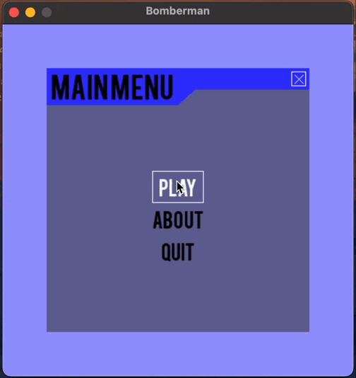
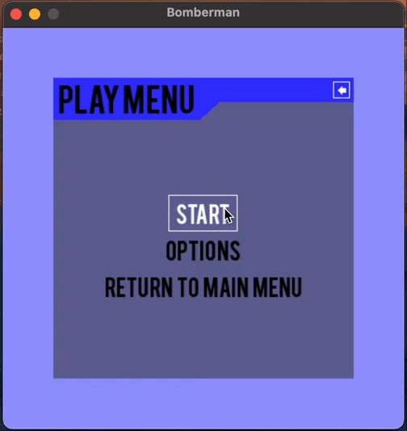

###My Bomberman Project
This is a Bomberman-inspired game developed as part of my final course project made by Tran Thi Tra My and Nguyen Thi Kim Oanh. It draws inspiration from the open-source Bomberman clone by Forestf90 with extensive enhancements to the AI, audio, and gameplay experience.

###About
This project is a Bomberman-style game where players navigate a maze, plant bombs, and face off against intelligent AI opponents. It incorporates six newly designed AI algorithms and background music to enrich the gameplay, building upon the original interface design.

###Menu Preview

### AI Performance Comparison
The table below compares the performance of five AI algorithms in Bomberman, based on their ability to achieve goals, processing speed, safety, and adaptability. Note: Q-Learning shows potential but requires further training to match other algorithms.

| Algorithm                   | Goal Success (%) | Processing Time (ms) | Safety Rate (%) | Flexibility (1-10) |
|-----------------------------|------------------|---------------------|-----------------|-------------------|
| BFS + Backtracking          | 75               | 5                   | 80              | 4                 |
| A*                          | 90               | 15                  | 95              | 9                 |
| Beam Search                 | 85               | 12                  | 90              | 6                 |
| Partial Observation         | 65               | 20                  | 70              | 8                 |
| Q-Learning                  | 50               | 7                   | 60              | 7                 |

- **Goal Success**: % of successful attempts to reach crates or safe tiles.
- **Processing Time**: Average time per path calculation (ms).
- **Safety Rate**: % of successful avoidance of bombs/explosions.
- **Flexibility**: Adaptability to complex scenarios (1-10).
  
###Controls
Arrow keys: Move
Space: Plant bomb

###Enhancements

_Introduced six new AI algorithms: Breadth-First Search (BFS), Beam Search, Q-Learning, Backtracking, A*, and Searching with Partially Observable, replacing the original AI implementations._

_Added menu sound effects to enhance user interaction, sourced from Pixabay._

_Retained the original interface design with minor refinements._

###Credits

_Original code: Inspired by the Bomberman clone by Forestf90 , licensed under GNU GPL-3.0.

_Sprites: "Bomb Party - The Complete Set" by Matt Hackett : https://opengameart.org/content/bomb-party-the-complete-set (Lost Decade Games), Cem Kalyoncu, and /usr/share, licensed under CC-BY 3.0. Some sprites were slightly modified (e.g., color adjustments).

_Sound effects: Menu sound effects sourced from Pixabay (https://pixabay.com/sound-effects/search/menu/), licensed under the Pixabay License.

###License

This project is licensed under the GNU General Public License v3.0. See the LICENSE file for details.
